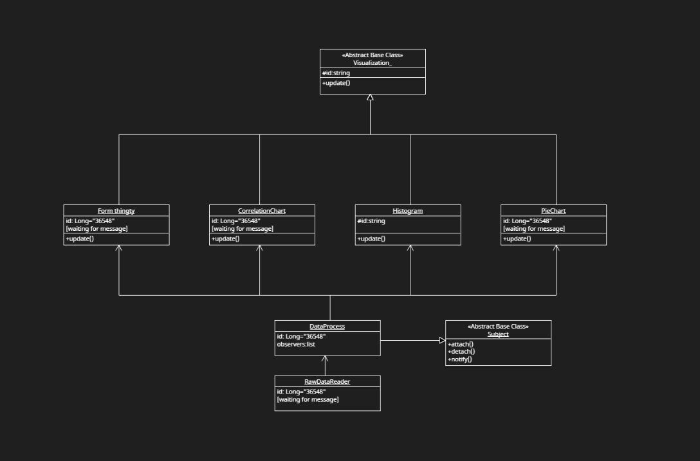

# Japanese show recommendation system

## What it does
This project aims to recommend a Japanese animated show (hereafter referred to as “the show” or “Anime”) to users based on their input of preferred shows. Users can further add additional criteria to the recommendation system, enhancing their satisfaction. The program contains a watch list function in which the user can save their recommended shows.

In addition, this program will allow the user to investigate the insight of the shows’ data, enhancing their ability to decide on their next show by providing users with data visualization. The examples of the intuition that the user will get from these data visualizations are: ‘What is the over-rating of anime in this genre’, ‘Does the score affect the percentage of people being able to finish the show or not’ or ‘What is the share of each type of anime in the list recommended shows.

However, right now, it can only view the correlation between score and drop rate.

## UI


## Installation
```bash
git clone https://github.com/knilios/Japanese-animated-show-recommendation-system.git
cd Japanese-animated-show-recommendation-system
python -m pip install -r requirements. txt
```

## How to run
```bash
python main.py
```

## Links to documents
Proposal - https://docs.google.com/document/d/1Qi0fGU4koof8QgauWVlN8KqHx2hm2YZaUMJ7Gj5Uqrs/edit?usp=sharing

Uml diagram:



data source: https://www.kaggle.com/datasets/hernan4444/anime-recommendation-database-2020

## Requirements
python version 3.11 or greater